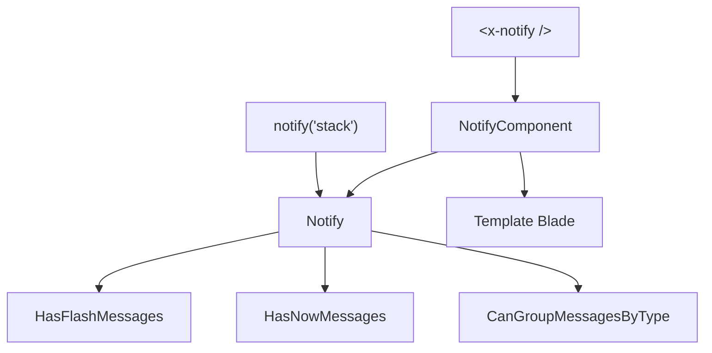

Laravel Notifier
================

Package Laravel pour uniformiser et simplifier l'enregistrement et l'affichage des messages/alertes dans les interfaces web d'une application Laravel.

**Attention** : à ne pas confondre avec les « [Notifications](https://laravel.com/docs/notifications) » de Laravel. Ce package utilise les « [Session Flash Data](https://laravel.com/docs/session#flash-data) ».

Concepts clés
-------------

### Deux modes de messages

- **Messages flash** : stockés en session, affichés à la requête HTTP **suivante** (typiquement après une redirection)
- **Messages instantanés (now)** : affichés dans la requête HTTP **courante**

### Quatre types

| Type | Usage |
|------|-------|
| `info` | Information neutre |
| `success` | Confirmation de réussite |
| `warning` | Avertissement |
| `error` | Erreur |

### Stacks

Les messages peuvent être organisés en **stacks** (piles) indépendantes pour afficher différents groupes de messages à différents endroits de la page.

Architecture
------------

| Fichier | Rôle |
|---------|------|
| `src/Notify.php` | Classe principale avec les traits |
| `src/helpers.php` | Helper `notify()` |
| `src/View/Components/NotifyComponent.php` | Composant Blade `<x-notify />` |
| `config/notifier.php` | Configuration (vue par défaut, tri, groupement) |
| `resources/views/` | Templates prédéfinis |

Sommaire
--------

- [Installation et configuration](./installation.md)
- [Déclaration des messages](./utilisation.md)
- [Affichage des messages](./affichage.md)
- [Templates de vues](./templates.md)
- [Personnalisation](./personnalisation.md)
